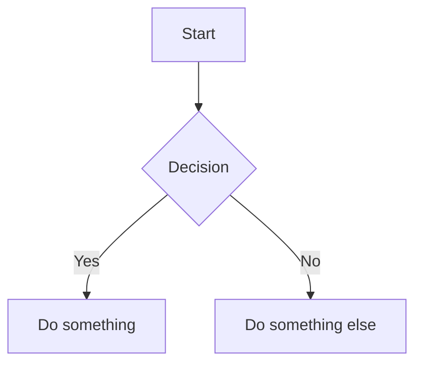

# mermaid-md

A local Node.js server for rendering Markdown files with Mermaid diagrams. Features live reload, multi-project support, and a clean reading experience.

## Features

- **Mermaid Diagrams** - Renders all Mermaid diagram types (flowcharts, sequence diagrams, class diagrams, etc.)
- **Live Reload** - Automatically refreshes when you edit your Markdown files
- **Multi-Project** - Manage multiple documentation folders from one interface
- **Syntax Highlighting** - Code blocks with copy-to-clipboard
- **Table of Contents** - Auto-generated for documents with multiple headings
- **Click to Expand** - Fullscreen view for diagrams
- **Reading Progress** - Shows scroll progress and percentage read

## Quick Start

```bash
git clone https://github.com/omnicus/mermaid-md.git
cd mermaid-md
npm install
node server.js /path/to/your/docs
```

Then open http://localhost:4000 in your browser.

## Adding Projects

1. Click **+ Add Project** in the sidebar
2. Enter a name and browse to the folder containing your Markdown files
3. Click **Save Project**

Projects are persisted in `~/.mermaid-server.json`.

## Writing Mermaid Diagrams

Add Mermaid diagrams to your Markdown files using fenced code blocks:

````markdown

````

All [Mermaid diagram types](https://mermaid.js.org/intro/) are supported.

## Configuration

| Environment Variable | Default | Description |
|---------------------|---------|-------------|
| `PORT` | 4000 | Server port |

## License

MIT
