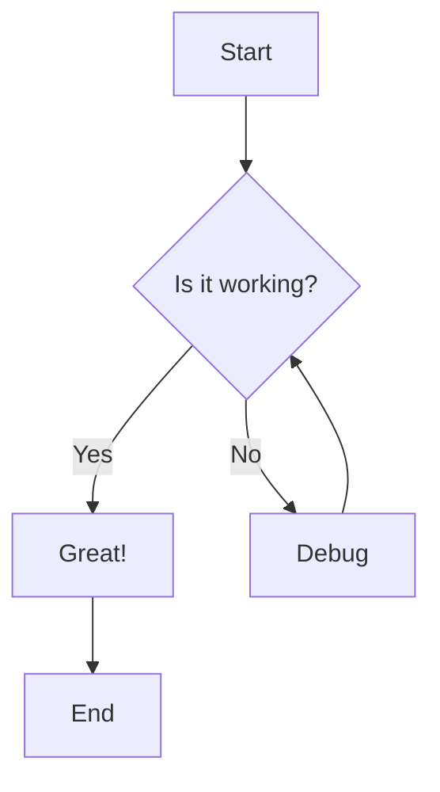
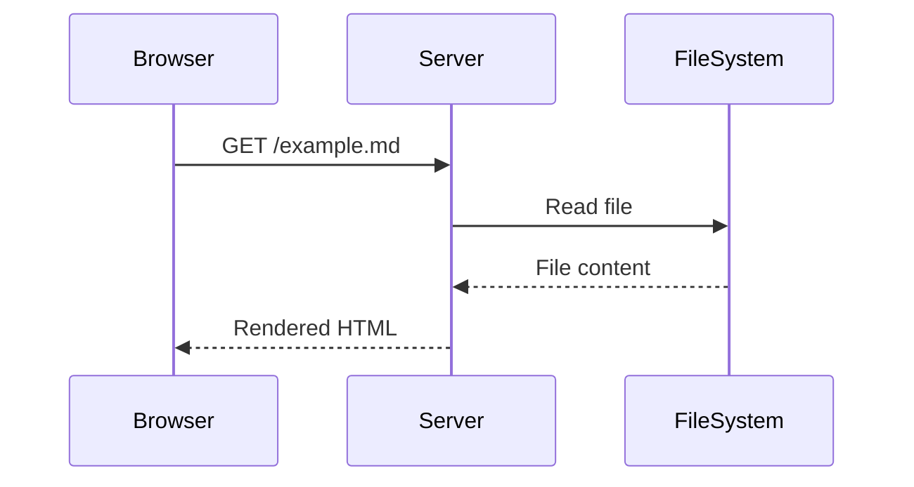
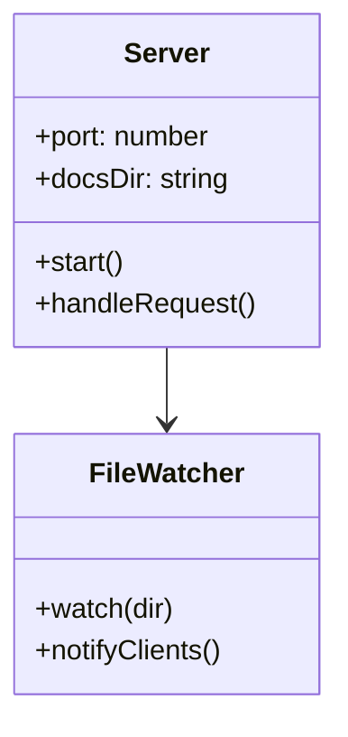

# Mermaid Server Example

This is an example markdown file to test the Mermaid server.

## Flowchart



## Sequence Diagram



## Class Diagram



## Code Example

Here's some JavaScript code:

```javascript
const server = http.createServer((req, res) => {
  res.end('Hello World!');
});
```

## Features

- **Live reload**: Edit your markdown files and see changes instantly
- **Mermaid support**: All mermaid diagram types are supported
- **Full markdown**: Tables, code blocks, lists, and more

| Feature | Status |
|---------|--------|
| Markdown | Done |
| Mermaid | Done |
| Live Reload | Done |

> This is a blockquote to show styling works correctly.
